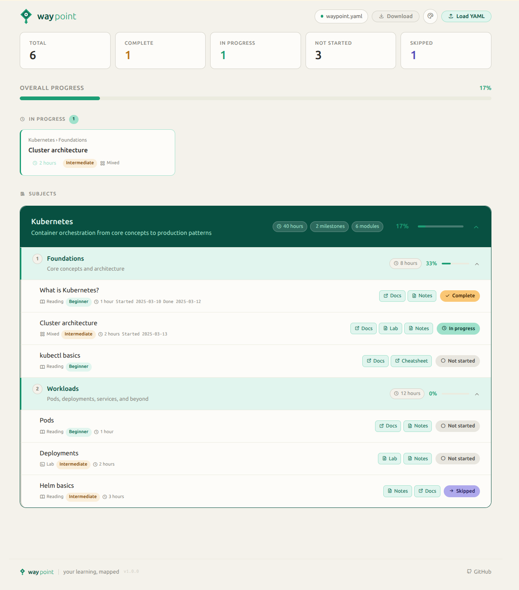

<br/><br/>

<div align="center">

<br/>

<picture>
  <source media="(prefers-color-scheme: dark)" srcset=".waypoint/branding/banners/waypoint_banner_darkbg.png">
  
</picture>


<br/><br/>


[](https://dustinestes.github.io/waypoint/)

<br/>

</div>

<br/><br/>

---

waypoint is a lightweight, file-based framework for structuring and tracking self-directed learning. waypoint gives you a single place to define and centralize what you're learning, organize your materials, track where you are, and navigate what's next — all from a single YAML file and a local application that runs in any browser.

---

<br/>

## What It Does

- **Scaffold** a consistent folder structure for notes, docs, labs, and scripts
- **Define** your learning roadmap in a single YAML file — subjects, milestones, and modules
- **Track** progress by updating module statuses directly in waypoint or the YAML file
- **Visualize** everything through waypoint with direct links to your materials

---

<br/>

## Who It's For

waypoint is for anyone learning outside of a single structured platform — pulling from learning platforms, documentation, YouTube, courses, books, and labs all at once and trying to make sense of where they started and where they are going next.

- Developers and engineers pursuing certifications or exploring new tools
- Students and career changers mapping a path into a new field
- Curious generalists tracking progress across multiple subjects simultaneously

### Use Cases

- Learners can curate their own waypoint files to help guide them on their educational journey
- Educators can build a structured syllabus with self-contained docs and links to resources
- Product owners can define a path for learning and understanding their product using a more interactive approach
- Anyone else looking to author structured, easy-to-use, high value training paths for others to utilize

> Need inspiration for how to utilize waypoint? → [`examples.md`](examples.md)

---

<br/>

## How It Works

1. **Define your roadmap** — write a `waypoint.yaml` that outlines your subjects, milestones, and individual learning modules
2. **Gather your materials** — collect links, write notes, set up labs, and save reference docs in the structured folder layout
3. **Connect everything** — reference your local files and external links directly in your YAML so nothing gets lost
4. **Track daily** — open waypoint, update module statuses as you learn, and download your updated YAML to save changes

---

<br/>

## What It Requires

| Requirement | Notes |
|-------------|-------|
| Modern browser | Chrome, Firefox, Edge, or Safari |
| Internet connection | Required to load fonts, icons, and the YAML parser from CDN |
| Text editor | Any editor — for writing and editing `waypoint.yaml` |
| Git | Optional — recommended for version-controlling your progress |

No install, no build step, no package manager, no server.

> Bundling all dependencies directly into `waypoint.html` to remove the internet requirement is planned. See [issue #17](https://github.com/dustinestes/waypoint/issues/17).

---

<br/>

## What It's Made Of

### Project Structure

```
waypoint/
├── .waypoint/          # Framework files — branding, AI tooling, deep docs
├── docs/               # Reference documentation, whitepapers, study guides
├── labs/               # Hands-on exercises, environment configs, lab files
├── notes/              # Personal notes organized by subject and module
├── scripts/            # Automation scripts, setup helpers, tooling
├── waypoint.yaml       # Your learning roadmap and progress tracker
└── waypoint.html       # waypoint — opens in any browser
```

> Full structure guide → [`.waypoint/docs/project-structure.md`](.waypoint/docs/project-structure.md)

<br/>

### waypoint YAML

Your entire learning plan lives in a single `waypoint.yaml`. Subjects contain milestones, milestones contain modules, and each module tracks its own status, metadata, and links to your materials. You define you journey so the file can be as high level or as granular as you need. Keep track of only what you find helpful and focus on what matters the most.

```yaml
subjects:

  - id: kubernetes
    title: "Kubernetes"
    description: "Container orchestration from core concepts to production patterns"
    estimated_time: "40 hours"

    milestones:

      - id: foundations
        title: "Foundations"
        estimated_time: "8 hours"

        modules:

          - id: what-is-kubernetes
            title: "What is Kubernetes?"
            type: reading
            difficulty: beginner
            estimated_time: "1 hour"
            status: complete
            resources:
              - type: external
                label: "Official Docs"
                url: "https://kubernetes.io/docs/concepts/overview/"
              - type: notes
                label: "My Notes"
                path: "notes/kubernetes/foundations/what-is-kubernetes.md"
```

> Full schema reference → [`.waypoint/docs/yaml-schema.md`](.waypoint/docs/yaml-schema.md)

<br/>

### waypoint Interface

Open `waypoint.html` in your browser to see a visual summary of your roadmap — progress by subject and milestone, module status at a glance, and direct links to your notes and materials. No build step, no server required.

<div align="center">
  
  <p><em>Waypoint — subjects, milestones, and module status at a glance</em></p>
</div>

> Full guide → [`.waypoint/docs/waypoint.md`](.waypoint/docs/waypoint.md)

---

<br/>

## Where To Start

Not ready to clone? **[Try the live demo](https://dustinestes.github.io/waypoint/)** — an interactive waypoint you can explore right in your browser, no setup required.

Otherwise, 3 steps and you're tracking:

1. **Fork or clone** this repository
   ```bash
   git clone https://github.com/dustinestes/waypoint.git my-learning
   cd my-learning
   ```
2. **Edit `waypoint.yaml`** to define your subjects, milestones, and modules
3. **Open `waypoint.html`** in your browser to start tracking

> Full walkthrough → [`.waypoint/docs/getting-started.md`](.waypoint/docs/getting-started.md)

---

<br/>

## What's Planned Next

- **Planned and in-progress** → [GitHub Issues](https://github.com/dustinestes/waypoint/issues)
- **Shipped by version** → [GitHub Releases](https://github.com/dustinestes/waypoint/releases)

---

<br/>

## How to Contribute

Contributions, ideas, and feedback are welcome. See [CONTRIBUTING.md](CONTRIBUTING.md) for guidelines.

---

<br/>

## How It's Licensed

MIT License with an Attribution Condition — free to use, fork, and modify. The footer attribution must remain intact in any redistribution or derivative work. See [LICENSE](LICENSE) for full terms.

---

<br/>

## With Thanks To

- **Dustin Estes** — creator, product design, and development
- **[Claude](https://claude.ai) (Anthropic)** — AI development assistant

<br>

---


<div align="right">v1.0.0</div>
<br clear="both">